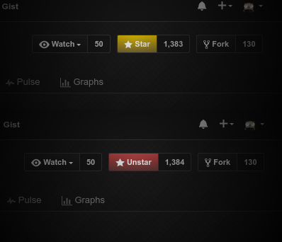

<h1>GitHub StarUnstar</h1>

Userstyle with colored **star** (gold) and **unstar** (red) buttons.

---

### Userstyles.org
https://userstyles.org/styles/138281/github-starunstar

## Requirements
- [userstyle manager](https://userstyles.org/help/stylish) for browser

This style is intended to be used with some dark style, such as [GitHub Dark](https://userstyles.org/styles/37035/github-dark).
